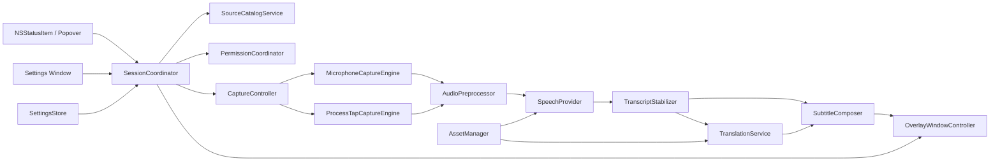
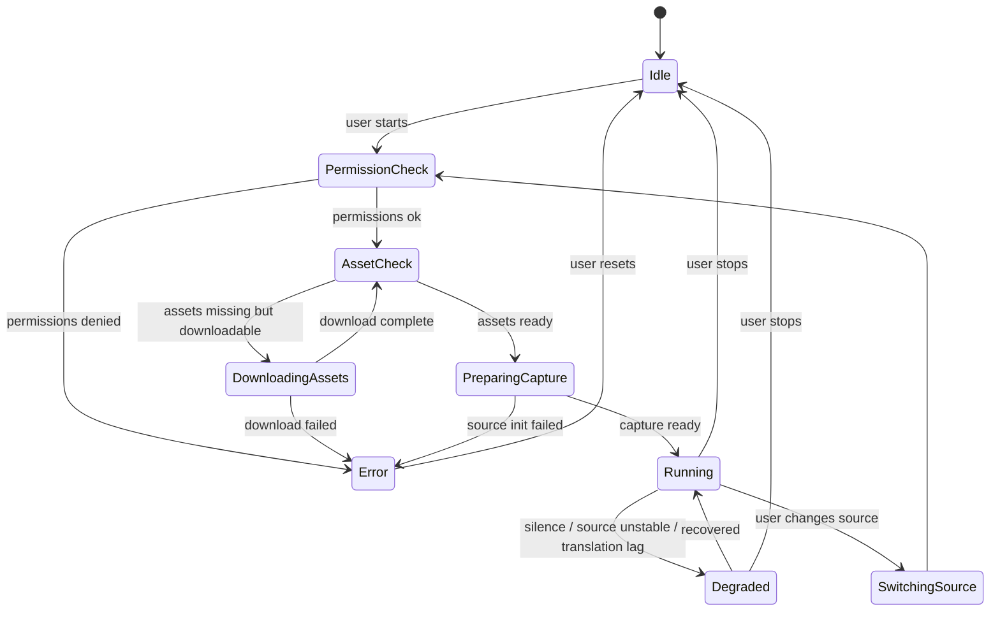

# v2s macOS 系统设计

版本：v1.0  
日期：2026-03-16  
项目代号：`v2s` (`voice to subtitles`)

## 1. 文档目标

本文档定义 `v2s` 的 macOS 产品与系统设计，目标是把需求落到可以直接进入技术实施的粒度，覆盖：

- 产品边界
- 平台与 API 选型
- 菜单栏常驻形态
- App 音频与硬件麦克风采集
- Apple 自带语音识别与翻译链路
- 顶部字幕条默认显示方案
- 权限、隐私、容错、性能、测试、发布策略

本文档默认 `v2s` 是一个本地运行、以隐私优先为前提的 macOS 菜单栏工具，不依赖自建后端。

## 2. 产品定义

### 2.1 产品目标

`v2s` 是一个 macOS 菜单栏应用，用户可以从正在发声的 App 或硬件麦克风中选定一个音频输入源，实时完成：

1. 语音识别
2. 文本翻译
3. 以桌面顶部悬浮字幕条方式持续显示结果

默认显示为双层字幕：

- 上层：翻译后的目标语言
- 下层：识别出的原始语言

### 2.2 核心用户场景

1. 用户正在用 Safari / Chrome / Firefox 打开 Google Meet 或网页视频，希望把该浏览器音频实时转成双语字幕。
2. 用户正在使用 Zoom / Slack / Teams / Webex / GoToMeeting，希望将会议声音直接显示为双语字幕。
3. 用户正在用 VLC / Infuse 播放视频，希望把播放器声音显示为双语字幕。
4. 用户选择 Mac 自带麦克风或外接麦克风，对现场说话做识别和翻译。

### 2.3 非目标

以下能力不进入 v1 必做范围：

- 同时采集多个输入源并混音识别
- 自动区分不同说话人并做多说话人分色
- 自动识别浏览器里的具体标签页
- 云端 ASR / 云端翻译
- 音视频录制与长期会话归档
- iPhone / iPad / Windows 端同步

## 3. 平台与技术基线

### 3.1 最低支持版本

建议最低支持版本：`macOS 15+`

理由：

- Apple 的 `Translation` framework 在 WWDC24 正式面向系统内翻译能力开放，macOS 侧对应 Sequoia 代际。
- `v2s` 明确要求使用 macOS 自带翻译 API，因此整体产品不能低于 Translation framework 可用的系统版本。
- App 音频定向采集建议使用 Apple 官方的 Core Audio tap 能力；这类能力在新系统上的稳定性更适合作为 v1 基线。

这是一个工程推断：最低版本是基于 Apple WWDC24/官方文档的 API 发布时间窗口做出的产品决策，而不是本文直接枚举某一页 API availability 文本。

### 3.2 识别引擎版本策略

为了兼顾“现在能做”和“未来能升级”，语音识别设计采用双实现：

| 系统代际 | 识别实现 | 说明 |
| --- | --- | --- |
| macOS 15 到较新的稳定系统 | `SFSpeechRecognizer` + `SFSpeechAudioBufferRecognitionRequest` | 兼容路径，优先要求本地识别 |
| 更新系统且存在新 Speech 能力时 | `SpeechAnalyzer` / `SpeechTranscriber` | 增强路径，优先用于更低延迟与更稳定的流式转写 |

这意味着 `v2s` 内部必须抽象 `SpeechProvider` 协议，避免把 UI 和具体语音 API 绑死。

### 3.3 发布形态

推荐 v1 先走：

- Developer ID 签名
- Hardened Runtime
- Notarization
- 官网直接分发

不建议把 v1 首发目标绑定到 Mac App Store，原因：

- `v2s` 需要跨 App 音频采集、菜单栏常驻、桌面级悬浮字幕层，这些能力在审核和沙箱边界上都有较高验证成本。
- 先用官方公开 API 做非沙箱或较少约束的直发版本，能更快验证音频源选择、权限与兼容性问题。

如果后续需要上架 Mac App Store，需要单独做一次“沙箱 + 权限 + 审核可接受性”技术验证。

### 3.4 技术栈

- 语言：`Swift 6`
- UI：`SwiftUI + AppKit`
- 菜单栏图标：`NSStatusItem` + `NSPopover` 或自定义弹出面板
- 设置窗口：`SwiftUI` 承载，必要处桥接 AppKit
- 顶部字幕条：`NSPanel` / 无边框 `NSWindow`
- App 音频采集：`Core Audio taps`
- 硬件麦克风采集：`AVFoundation` 或 Core Audio HAL
- 语音识别：`Speech` framework
- 翻译：`Translation` framework
- 持久化：`UserDefaults` + `Application Support` 中的 JSON / plist
- 日志：`OSLog`

### 3.5 为什么不是纯 SwiftUI

`v2s` 不是普通文档型 App，以下点决定它必须是混合架构：

- 菜单栏工具在生命周期、激活策略、状态图标切换上，`NSStatusItem` 更可控。
- 顶部字幕条需要非激活、可穿透、跨 Space、可置顶的窗口行为，AppKit 更成熟。
- 低级音频采集与 Core Audio tap 管理天然是底层系统编程，不适合直接塞进 SwiftUI 层。

## 4. 关键产品决策

### 4.1 单次只允许一个输入源

v1 只允许一个活动输入源：

- 一个 App
- 或一个麦克风

理由：

- 识别与翻译链路需要稳定上下文。
- 多源混合会导致字幕顺序混乱、语言切换不确定、翻译上下文被污染。
- 菜单栏工具的核心价值是轻量与即时，不是专业混音台。

### 4.2 “App 级”而不是“标签页级”

当用户选择浏览器时，v1 采集的是整个浏览器 App 的音频，不是单独某个标签页。

这意味着：

- 选择 Chrome 时，会采集 Chrome 当前所有输出声音。
- 如果用户在 Chrome 一边开 Meet、一边播放其他网页视频，字幕会混合。

这是一个明确的产品边界，必须在设置页和 onboarding 中写清楚。

### 4.3 优先本地识别和本地翻译

默认策略：

- 优先使用设备端可用的本地语音识别能力
- 优先使用系统本地翻译模型
- 不上传音频到自有服务器

如果某些语言的系统语音识别在当前系统上仍依赖 Apple 服务器，这一点必须在 UI 上向用户明确标识为“兼容模式”。

## 5. 用户体验设计

## 5.1 首次启动流程

首次启动进入一个轻量 onboarding 窗口，步骤如下：

1. 说明 `v2s` 是菜单栏工具，默认不在 Dock 常驻。
2. 说明可选输入源包括“App 音频”和“麦克风”。
3. 询问默认输入语种和输出语种。
4. 如果用户先选麦克风，则请求麦克风权限和语音识别权限。
5. 如果用户先选 App 音频，则先展示“App 音频捕获需要的系统权限说明”。
6. 检查所选语言的语音 / 翻译资源是否已安装。
7. 展示顶部字幕条预览。
8. 完成后进入纯菜单栏运行形态。

### 5.2 菜单栏图标行为

状态栏图标始终存在，除非用户在设置中手动关闭或退出应用。

图标状态：

- 灰色：空闲
- 蓝色：正在采集与识别
- 橙色：正在下载语音 / 翻译资源
- 红色：错误或权限缺失

点击图标展开快捷设定面板，默认包含：

- 输入源选择
- 输入语音语言选择
- 输出字幕语言选择
- 开始 / 停止
- 显示 / 隐藏字幕条
- 打开详细设置
- 查看权限状态
- 退出

### 5.3 快捷设定面板结构

建议使用自定义弹出面板而不是纯系统菜单，因为需要：

- 显示运行中状态
- 显示语言资源下载状态
- 显示输入音量条与识别中状态
- 支持更复杂的 source picker

面板分区：

1. Session Header
   - 当前状态
   - 当前源名称
   - 开始 / 停止按钮
2. Input Source
   - `Applications`
   - `Microphones`
3. Languages
   - `Input Language`
   - `Output Subtitle Language`
4. Overlay Quick Controls
   - 显示 / 隐藏
   - 透明度
   - 字体大小
5. Footer
   - `Open Settings`
   - `Permissions`
   - `Quit`

### 5.4 详细设置窗口

设置窗口建议拆成 6 个 tab：

1. `General`
2. `Sources`
3. `Recognition`
4. `Translation`
5. `Subtitle Overlay`
6. `Advanced`

#### General

- 开机启动
- 启动后自动恢复上次输入源
- 启动后自动开始识别
- 是否显示 Dock 图标
- 全局快捷键

#### Sources

- 默认输入源类型
- 是否自动重连已选 App
- 是否允许“只显示常见 App”
- 无声超时阈值
- 麦克风增益与噪声门限

#### Recognition

- 输入语言
- 是否优先本地识别
- 是否显示 partial result
- 标点增强
- 断句策略

#### Translation

- 输出语言
- 缺失语言资源时是否自动下载
- 是否只翻译稳定片段
- 输入与输出相同语言时的显示策略

#### Subtitle Overlay

- 位置
- 宽度
- 透明度
- 背景模糊
- 字体与字号
- 上下行顺序
- 自动隐藏时间
- 多显示器策略
- 点击穿透

#### Advanced

- 诊断日志
- 性能模式
- 语音资源状态
- 翻译资源状态
- 导出诊断包

## 6. 默认字幕显示方案

这是本产品最重要的默认体验，必须定义为固定规格，而不是“以后再调”。

### 6.1 默认位置与几何参数

默认字幕条是桌面顶部中央的长条形半透明窗口：

| 项目 | 默认值 |
| --- | --- |
| 显示器 | 主显示器；若选定 App 的主窗口位于其他显示器，则优先跟随该显示器 |
| 水平位置 | 居中 |
| 顶部间距 | 距可视区域顶部 12 pt，不覆盖菜单栏 |
| 宽度 | `min(屏幕可视宽度 * 0.82, 1440pt)` |
| 最小宽度 | 720 pt |
| 高度 | 自适应，最小 88 pt，最大 180 pt |
| 圆角 | 16 pt |
| 内边距 | 上下 12 pt，左右 20 pt |
| 背景 | 深色半透明 + blur |
| 默认透明度 | 0.32 |
| 动画 | 120ms fade in / 160ms fade out |

### 6.2 默认排版

双层排版固定如下：

- 上层：翻译语言
- 下层：识别语言

默认样式：

| 项目 | 上层翻译 | 下层原文 |
| --- | --- | --- |
| 字号 | 24 pt | 18 pt |
| 字重 | Semibold | Regular |
| 颜色 | 纯白或接近纯白 | 80% 白 |
| 最大行数 | 2 | 2 |
| 对齐 | 居中 | 居中 |
| 行距 | 4 pt | 2 pt |

### 6.3 默认行为

- 有声音且有识别结果时，字幕条保持完全可见。
- 连续 4 秒无新结果时，字幕条降到 60% 可见度。
- 连续 20 秒无新结果时，清空内容但保留容器。
- 停止会话后，字幕条立即隐藏。
- 字幕条默认点击穿透，不抢焦点。

### 6.4 可配置显示方式

详细设置允许用户切换这些模式：

- 双语双层
- 仅显示翻译
- 仅显示原文
- 顶部条
- 底部条
- 浮动卡片
- 固定在所有显示器
- 固定在指定显示器

v1 默认只把“顶部长条双层字幕”做到极稳，其他模式作为同一套渲染引擎上的样式变体。

## 7. 总体架构



### 7.1 模块总览

| 模块 | 责任 |
| --- | --- |
| `SessionCoordinator` | 协调整个会话生命周期 |
| `SourceCatalogService` | 枚举可选 App 和麦克风 |
| `PermissionCoordinator` | 统一处理 TCC 权限状态 |
| `CaptureController` | 启停具体采集引擎 |
| `MicrophoneCaptureEngine` | 采集硬件麦克风 PCM |
| `ProcessTapCaptureEngine` | 采集目标 App 的输出音频 |
| `AudioPreprocessor` | 重采样、混单声道、归一化、静音门限 |
| `SpeechProvider` | 屏蔽新旧 Speech API 差异 |
| `TranscriptStabilizer` | 去抖动、断句、稳定片段提交 |
| `TranslationService` | 调 Translation framework 做文本翻译 |
| `SubtitleComposer` | 拼装顶部字幕最终模型 |
| `OverlayWindowController` | 管理顶部字幕窗口 |
| `SettingsStore` | 设置持久化与 schema 迁移 |
| `AssetManager` | 检查语音 / 翻译资源是否可用 |

## 8. 输入源设计

## 8.1 输入源分类

系统内定义统一模型：

```swift
enum InputSourceKind: Codable {
    case application(bundleID: String, displayName: String, processGroupID: String?)
    case microphone(deviceUID: String, displayName: String)
}
```

运行时再扩展为：

```swift
struct RuntimeInputSource {
    let id: UUID
    let kind: InputSourceKind
    let iconPNGData: Data?
    let status: SourceAvailability
    let lastSeenAt: Date
    let metadata: [String: String]
}
```

### 8.2 App 音频源发现

App 源发现逻辑：

1. 通过 `NSWorkspace.shared.runningApplications` 枚举运行中的普通 App。
2. 维护一个“常见目标 App 规则表”，优先展示：
   - 浏览器
   - 会议软件
   - 视频播放器
3. 对每个 App 记录：
   - `bundleIdentifier`
   - 显示名
   - 图标
   - 主进程 PID
   - 最近前台时间
4. 当用户选中某个 App 后，再进入“进程组解析”阶段。

### 8.3 为什么需要“进程组解析”

很多目标 App 并不是一个单进程：

- 浏览器会有 WebContent / Helper / Renderer 进程
- Teams / Slack / Electron App 可能有 Helper 进程
- Safari 的音频很可能由 WebKit 子进程发出

因此，“用户选中 Safari”并不等于只盯着 Safari 主 PID；系统必须把与该 App 相关的音频输出进程一起纳入。

### 8.4 App 进程组解析策略

定义 `ProcessGroupResolver`，职责如下：

1. 从用户选择的主 App PID 出发。
2. 查询子进程与相关辅助进程。
3. 根据 bundle ID 规则与父子关系，拼出捕获 PID 集合。
4. 每 2 秒刷新一次，以便覆盖新启动的 helper 进程。
5. 如果进程树变化影响到 tap 绑定，则执行无感知重绑。

规则优先级：

1. 显式子进程
2. 同厂商/同 App helper bundle ID 映射
3. 同一 audit session 的相关进程
4. 白名单修正规则

### 8.5 App 音频采集实现

主方案：Core Audio process tap

理由：

- 需求是“选择某个正在发声的 App”，不是“采集整个系统混音”。
- Apple 官方文档已经给出“从某个进程或一组进程捕获输出音频”的路径。
- 这比把 ScreenCaptureKit 强行当音频框架更贴近需求本质。

`ProcessTapCaptureEngine` 的职责：

1. 接收 `ProcessGroupResolver` 提供的 PID 集。
2. 创建对应的 tap。
3. 输出统一 PCM 帧流。
4. 暴露实时电平与无声检测状态。
5. 在目标 App 重启时自动恢复。

### 8.6 App 音频采集失败时的产品反馈

如果用户选择的 App 无法捕获到音频，UI 不能只报一个通用错误，必须细分：

- 权限缺失
- App 已退出
- 当前没有音频输出
- 该 App 的音频在受保护路径上不可捕获
- 语言资源未就绪

其中“受保护路径不可捕获”非常重要。某些 DRM 媒体或受系统保护的播放链路，可能不会给出可用音频数据。这个限制必须写进产品说明。

### 8.7 麦克风输入设计

麦克风模式必须支持：

- Mac 内建麦克风
- USB 麦克风
- 蓝牙耳机麦克风
- 其他系统已识别输入设备

推荐实现：

- 设备枚举用 `AVCaptureDevice` 或 Core Audio HAL
- 真正采集使用 `AVCaptureSession` + `AVCaptureAudioDataOutput`

选择该方案的原因：

- 用户明确要求可以选具体硬件 mic
- `AVCaptureSession` 对设备选择和 sample buffer 时间戳更直接
- 与 App 音频链路统一后，后级只处理标准化 PCM

### 8.8 输入源切换

用户在运行中切换源时，状态机如下：

1. 停止当前采集引擎
2. 保留最近一次字幕 1 秒
3. 清空未提交翻译任务
4. 创建新源的采集链路
5. 重新检查所需权限与资源
6. 进入预热状态
7. 首批音频稳定后再显示“Running”

要求：

- 切换过程不崩溃
- 不出现旧源的字幕残留到新源
- 不把旧翻译结果套到新输入上

## 9. 音频处理链路

### 9.1 统一音频格式

无论来自 App 还是 mic，后级都统一成：

- PCM float32
- mono
- 16 kHz
- 20 ms frame

统一格式的原因：

- 降低语音识别适配复杂度
- 控制 CPU 与内存
- 便于做统一的静音判断与 ring buffer

### 9.2 预处理步骤

`AudioPreprocessor` 顺序：

1. 输入格式识别
2. 重采样
3. 声道合并
4. 电平归一化
5. 静音门限判断
6. 可选轻量降噪
7. 输出到识别引擎

### 9.3 静音与断句策略

音频层做两类判断：

1. `silence gate`
   - 用于识别“现在没有声音”
2. `utterance boundary hint`
   - 用于提示识别链路断句

默认阈值：

- RMS 低于阈值持续 800 ms：判定为静音段
- 句内短停顿 250 ms：不断句
- 句间停顿 900 ms：可触发提交稳定片段

这只是默认工程值，必须开放到高级设置中。

### 9.4 Ring Buffer

维护 5 秒音频 ring buffer，作用：

- 语音识别预热
- 源切换后的平滑过渡
- 调试问题时抓取最近几秒上下文

默认不落盘，只在内存中保存。

## 10. 语音识别设计

## 10.1 识别接口抽象

定义统一协议：

```swift
protocol SpeechProvider {
    func prepare(for locale: Locale) async throws
    func start(stream: AsyncStream<AudioFrame>) async throws -> AsyncThrowingStream<TranscriptEvent, Error>
    func stop() async
}
```

实现：

- `LegacySpeechProvider`
- `AdvancedSpeechProvider`

### 10.2 LegacySpeechProvider

适用：

- Translation framework 已可用，但新 Speech API 不可用的系统

实现原则：

- `SFSpeechRecognizer`
- `SFSpeechAudioBufferRecognitionRequest`
- 默认 `shouldReportPartialResults = true`
- 默认 `requiresOnDeviceRecognition = true`

如果所选语言不支持设备端识别：

- UI 显示“该语言当前系统可能需要 Apple 在线识别”
- 用户可以在设置中选择是否允许兼容模式继续

### 10.3 AdvancedSpeechProvider

适用：

- 新系统提供 `SpeechAnalyzer` / `SpeechTranscriber`

实现原则：

- 通过系统语音资产机制提前检查资源
- 用更现代的流式接口提高稳定性
- 输出时间戳更可靠的片段事件

### 10.4 识别结果事件模型

```swift
struct TranscriptEvent {
    let utteranceID: UUID
    let text: String
    let rangeInUtterance: Range<String.Index>?
    let isFinal: Bool
    let confidence: Double?
    let startTime: TimeInterval?
    let endTime: TimeInterval?
    let receivedAt: Date
}
```

### 10.5 稳定片段提交机制

实时识别最大问题不是“拿不到字”，而是“字会反复改”。  
因此要引入 `TranscriptStabilizer`。

规则：

1. partial result 立即显示在下层原文行
2. 同一尾部文本连续两次未变化，或超过 350 ms 未变，标记为“稳定”
3. 遇到明确 `isFinal` 时立即提交稳定片段
4. 只有稳定片段才进入翻译队列

好处：

- 降低翻译频率
- 减少上层翻译行频繁抖动
- 原文仍保持实时感

### 10.6 断句策略

默认按语言族做不同断句：

- CJK：看到 `。！？` 或长停顿时提交
- 拉丁文字：看到 `.?!`、`;` 或长停顿时提交
- 超长句：达到 120 个字符时在最近子句边界强制提交

### 10.7 语言选择

用户必须显式选择输入语音语言。  
v1 不做自动语种识别，原因：

- Apple Speech 识别通常需要明确 locale
- 自动探测会显著增加误判与延迟
- 菜单栏产品应优先稳定，而不是魔法行为

## 11. 翻译设计

## 11.1 TranslationService 结构

`TranslationService` 负责：

1. 检查源语言和目标语言是否支持
2. 检查模型是否已下载
3. 接收稳定片段
4. 排队翻译
5. 输出与原文片段关联的翻译结果

### 11.2 为什么只翻译稳定片段

如果对每个 partial result 都翻译，会出现：

- 频繁撤回
- 同一句上层文本不断重排
- CPU 与系统翻译调用次数暴涨

因此 v1 规定：

- 原文可以实时 partial
- 翻译只对稳定片段执行

### 11.3 翻译任务模型

```swift
struct TranslationJob {
    let segmentID: UUID
    let sourceLocale: Locale
    let targetLocale: Locale
    let sourceText: String
    let submittedAt: Date
}
```

### 11.4 Translation framework 集成方式

Apple 的 `TranslationSession` 生命周期与 SwiftUI 视图关系较强，因此建议设计一个桥接层：

- `TranslationHostView`
- `TranslationCoordinator`
- `TranslationService`

职责分离：

- `TranslationHostView`：挂载系统 translation task
- `TranslationCoordinator`：管理 session 生命周期与请求串行化
- `TranslationService`：对业务层暴露简单 async API

### 11.5 同语言输出策略

如果输入语言和输出语言相同：

- 默认跳过翻译调用
- 上层直接镜像原文
- 设置中允许开启“自动折叠重复行”

### 11.6 翻译批处理策略

默认一条稳定片段一个 translation job。  
如果相邻片段在 400 ms 内连续提交，且属于同一句，可在队列中合并成一个 batch，再回填到同一个 `utteranceID`。

好处：

- 降低碎片化翻译
- 减少过短短语造成的翻译质量下降

### 11.7 语言资源管理

`AssetManager` 必须分别管理两类资源：

1. Speech 资源
2. Translation 资源

状态：

- installed
- downloadable
- downloading
- unavailable
- unsupported

如果资源缺失：

- 快捷面板显示下载按钮
- 设置页显示详细状态
- 若用户允许自动下载，则在后台执行

## 12. 字幕合成与渲染模型

## 12.1 SubtitleComposer 的职责

`SubtitleComposer` 把三个输入拼成一个稳定 UI 模型：

1. 原文稳定片段
2. 原文实时 partial
3. 翻译稳定片段

输出：

```swift
struct OverlayViewState {
    let sourceCommitted: String
    let sourcePreview: String?
    let translatedCommitted: String
    let sessionState: SessionState
    let lastUpdatedAt: Date
    let levelMeter: Float
}
```

### 12.2 显示规则

下层原文：

- `sourceCommitted + sourcePreview`
- 其中 preview 使用较淡颜色

上层翻译：

- 只显示已经完成翻译的 committed 文本
- 不显示翻译中的半成品

### 12.3 去重与裁切

显示层要做两类处理：

1. 去重
   - 防止 partial result 与 committed result 重叠显示
2. 裁切
   - 防止文本过长导致高度无限增长

默认裁切策略：

- 每层最多 2 行
- 超出时保留尾部最新内容
- 头部裁切时加省略号

### 12.4 多语言排版细节

必须考虑：

- CJK 与拉丁文字混排
- RTL 语言
- 不同脚本的行高差异
- 长单词自动换行

实现建议：

- 用 `AttributedString`
- 根据目标语言设置 `paragraphStyle`
- 针对 RTL 切换自然对齐与基于语言的方向

## 13. 顶部字幕窗口实现

## 13.1 窗口类型

推荐使用 `NSPanel` 或无边框 `NSWindow`，要求：

- `nonactivating`
- 无标题栏
- 无阴影或弱阴影
- 可置顶
- 默认忽略鼠标事件

### 13.2 窗口级别与 Space 行为

窗口行为：

- 出现在所有 Space
- 支持全屏辅助显示
- 不进入窗口循环
- 不抢键盘焦点

建议配置：

- `collectionBehavior` 包含 `canJoinAllSpaces`
- `collectionBehavior` 包含 `fullScreenAuxiliary`
- `ignoresMouseEvents = true`

### 13.3 视觉实现

背景层建议使用：

- `NSVisualEffectView`
- 深色 `material`
- 叠加一层黑色透明遮罩

原因：

- 保持半透明
- 对浅色 / 深色桌面都有足够对比
- 更像系统级工具而不是普通 App 窗口

### 13.4 交互模式

默认字幕条不可点。  
如果用户需要调位置，提供两种方式：

1. 在设置页输入精确位置
2. 从菜单栏点“调整字幕位置”，此时临时取消点击穿透并出现拖拽框

### 13.5 多显示器策略

默认规则：

- App 音频源：跟随目标 App 当前主窗口所在显示器
- 麦克风源：使用用户设定显示器，默认主显示器

如果无法判断 App 主窗口位置，则回退主显示器。

## 14. 状态机



`SessionState`：

```swift
enum SessionState: String, Codable {
    case idle
    case permissionCheck
    case assetCheck
    case downloadingAssets
    case preparingCapture
    case running
    case degraded
    case switchingSource
    case error
}
```

## 15. 数据持久化设计

## 15.1 SettingsStore

简单设置放 `UserDefaults`，复杂设置与预设文件放：

- `~/Library/Application Support/v2s/settings.json`
- `~/Library/Application Support/v2s/presets/*.json`

### 15.2 设置模型

```swift
struct AppSettings: Codable {
    var launchAtLogin: Bool
    var restoreLastSession: Bool
    var autoStartOnLaunch: Bool
    var showDockIcon: Bool
    var preferredInputSource: InputSourceKind?
    var inputLocaleIdentifier: String
    var outputLocaleIdentifier: String
    var preferOnDeviceRecognition: Bool
    var allowServerRecognitionFallback: Bool
    var showPartialResults: Bool
    var autoDownloadAssets: Bool
    var overlayStyle: OverlayStyle
    var diagnosticsEnabled: Bool
}
```

### 15.3 OverlayStyle

```swift
struct OverlayStyle: Codable {
    var mode: OverlayMode
    var targetDisplayID: String?
    var topInset: Double
    var widthRatio: Double
    var maxWidth: Double
    var minWidth: Double
    var backgroundOpacity: Double
    var blurEnabled: Bool
    var translatedFontSize: Double
    var sourceFontSize: Double
    var translatedFirst: Bool
    var clickThrough: Bool
    var autoDimAfterSeconds: Double
    var clearAfterSeconds: Double
}
```

### 15.4 数据保留策略

默认：

- 不保存音频
- 不保存转写内容
- 不上传任何文本到自建服务

只有设置项被持久化。

## 16. 权限与隐私设计

## 16.1 需要的权限

`v2s` 至少涉及这些权限：

- 麦克风权限
- 语音识别权限
- App 音频捕获相关权限

实现层面需要在目标 SDK 与最终采集方案确认后，补齐对应的 Info.plist usage description key。  
其中麦克风与语音识别是明确刚需；App 音频捕获所需描述键和系统权限表现，必须在技术 Spike 阶段用最终 SDK 实测确认。

### 16.2 权限请求原则

- 按需请求，不一次性全弹
- 在用户明确选择某类源时才请求该类权限
- 在弹系统权限框前先给出简洁解释页
- 被拒后提供“去系统设置开启”的直达说明

### 16.3 隐私原则

- 默认本地处理
- 默认不落盘
- 默认不开遥测
- release log 不记录完整字幕文本
- 诊断包导出默认脱敏

## 17. 性能目标

以 Apple Silicon 为优先优化目标。

目标指标：

| 指标 | 目标 |
| --- | --- |
| 麦克风到原文下层首字出现延迟 | p50 < 500 ms |
| App 音频到原文下层首字出现延迟 | p50 < 700 ms |
| 稳定片段到上层翻译出现延迟 | p50 < 1200 ms |
| 空闲内存占用 | < 120 MB |
| 连续运行内存占用 | < 220 MB |
| Apple Silicon 常规 CPU | < 18% |

### 17.1 性能关键点

- 音频回调线程绝不做 UI 工作
- translation queue 必须串行或受控并发
- 识别与翻译结果统一回到主线程更新 UI
- overlay 渲染只消费已经整理好的 view state

## 18. 错误处理与降级策略

### 18.1 常见错误

1. 用户拒绝麦克风权限
2. 用户拒绝语音识别权限
3. App 音频捕获失败
4. 所选语言不支持本地识别
5. 翻译模型缺失
6. 目标 App 退出或重启
7. 长时间静音
8. DRM / 受保护媒体不可捕获

### 18.2 对应降级

| 场景 | 降级策略 |
| --- | --- |
| 本地识别不可用 | 提示兼容模式，用户决定是否允许系统在线识别 |
| 翻译模型缺失 | 下层原文继续显示，上层显示“等待下载翻译资源” |
| App 退出 | 会话进入 `degraded`，3 秒内尝试重连 |
| 长时间静音 | 保持运行但 dim overlay |
| App 音频不可捕获 | 引导用户改用麦克风或更换源 |

## 19. 工程目录建议

建议从一开始按模块拆目录，而不是把所有东西放进一个 App target：

```text
v2s/
  App/
    V2SApp.swift
    AppDelegate.swift
    SessionCoordinator.swift
  UI/
    StatusBar/
    Popover/
    Settings/
    Overlay/
  Domain/
    Models/
    State/
    Services/
  Infrastructure/
    Audio/
    Speech/
    Translation/
    Permissions/
    Persistence/
    Diagnostics/
  Resources/
    Assets.xcassets
    Localizable.xcstrings
  Tests/
    Unit/
    Integration/
    UI/
  docs/
    v2s-system-design.md
```

## 20. 测试策略

## 20.1 单元测试

必须覆盖：

- `TranscriptStabilizer`
- `SubtitleComposer`
- `SettingsStore` schema 迁移
- `ProcessGroupResolver` 规则
- `SessionState` 转换

### 20.2 集成测试

准备固定音频样本：

- 英语会议片段
- 中文会议片段
- 中英夹杂片段
- 视频对白片段
- 静音片段

验证：

- 原文实时性
- 翻译延迟
- 长句断句质量
- 切换源时不串字幕

### 20.3 手工兼容性测试矩阵

至少覆盖：

- Safari
- Chrome
- Firefox
- Zoom
- Slack
- Teams
- Webex
- GoToMeeting
- VLC
- Infuse
- 内建麦克风
- USB 麦克风
- 蓝牙耳机麦克风

同时要测试：

- 单显示器
- 双显示器
- 全屏 App
- 深色 / 浅色桌面
- 权限拒绝后恢复

## 21. 实施阶段建议

### Phase 0: Technical Spike

目标：

- 验证 Core Audio tap 能否稳定捕获目标 App
- 验证所需权限与系统表现
- 验证 Translation framework 语言资源下载和调用链
- 验证顶部字幕条在全屏 / 多显示器 / Space 中的表现

交付：

- 3 个最小 demo
  - mic -> speech
  - app audio -> speech
  - text -> translation -> overlay

### Phase 1: MVP Shell

目标：

- 菜单栏图标
- 快捷设定面板
- 设置窗口
- 顶部字幕条
- 设置持久化

### Phase 2: 麦克风链路

目标：

- 完成 mic capture
- 完成 speech pipeline
- 完成原文 / 翻译双层显示

### Phase 3: App 音频链路

目标：

- 完成 App 源发现
- 完成进程组解析
- 完成 process tap capture
- 完成自动重连与错误提示

### Phase 4: 稳定化与发布

目标：

- 性能优化
- 权限流程打磨
- 安装包、签名、notarization
- 兼容性测试

## 22. 关键风险与提前验证项

### 22.1 风险 1：App 音频捕获权限与 SDK 细节

风险：

- 不同 macOS / SDK 版本在系统权限展示与 usage description key 上可能有差异。

措施：

- 在 Phase 0 用最终目标 SDK 做实测，不要只看旧文档或二手博客。

### 22.2 风险 2：浏览器类 App 的多进程复杂度

风险：

- 浏览器音频不一定从主进程发出。

措施：

- 实现 `ProcessGroupResolver`
- 针对主流浏览器单独建立规则用例

### 22.3 风险 3：DRM / 受保护内容

风险：

- 部分流媒体内容可能无法被 process tap 正常捕获。

措施：

- 在产品说明中明确限制
- 提供“改用麦克风源”的降级路径

### 22.4 风险 4：语言覆盖

风险：

- 系统语音识别与翻译支持的语言集合并不完全一致。

措施：

- UI 中只允许用户选系统当前可用且满足组合要求的语言对
- 缺失时明确显示 unsupported，而不是静默失败

## 23. MVP 验收标准

满足以下条件，才算 `v2s` 的 v1 MVP 成立：

1. 用户可以从菜单栏选择一个运行中的 App 或一个硬件麦克风。
2. 用户可以在菜单栏里设置输入语音语言和输出字幕语言。
3. 开始后，顶部半透明字幕条稳定出现。
4. 字幕条上层显示翻译，下层显示原文。
5. 麦克风路径在常见语言上可稳定工作。
6. 至少 3 类 App 源通过验证：
   - 浏览器类
   - 会议类
   - 视频播放器类
7. 权限缺失、模型缺失、源退出、长时间静音等错误路径都有明确 UI 提示。
8. 默认不保存音频与文字。

## 24. 最终推荐方案总结

`v2s` 的推荐落地方案是：

- 菜单栏常驻 Agent App
- `SwiftUI + AppKit` 混合 UI
- App 音频走 Core Audio process tap
- 麦克风走 AVFoundation / Core Audio 设备采集
- 语音识别封装成双实现：
  - 新系统走 `SpeechAnalyzer` / `SpeechTranscriber`
  - 兼容系统走 `SFSpeechRecognizer`
- 翻译统一走 `Translation` framework
- 字幕输出统一走一个顶部双层 overlay engine
- 默认本地处理，不落盘，不上云

这个方案最符合你的原始目标，同时把“Mac 上任意正在发声的软件”和“顶部双层字幕条”这两件事作为架构中心，而不是把它做成一个普通的窗口型 App。

## 25. 参考资料

以下为本设计依赖的 Apple 官方资料与会话；其中版本边界结论已在正文中按“工程推断”标注：

- [Speech framework 官方文档](https://developer.apple.com/documentation/speech)
- [Bringing advanced speech-to-text capabilities to your app (WWDC25)](https://developer.apple.com/videos/play/wwdc2025/277/)
- [Translation framework 官方文档](https://developer.apple.com/documentation/translation)
- [Meet the Translation API (WWDC24)](https://developer.apple.com/videos/play/wwdc2024/10117/)
- [Capturing system audio with Core Audio taps](https://developer.apple.com/documentation/coreaudio/capturing-system-audio-with-core-audio-taps)
- [ScreenCaptureKit 官方文档](https://developer.apple.com/documentation/screencapturekit)
- [Take ScreenCaptureKit to the next level (WWDC22)](https://developer.apple.com/videos/play/wwdc2022/10156/)
- [NSStatusItem / status bar 官方文档](https://developer.apple.com/documentation/appkit/nsstatusitem)
- [MenuBarExtra 官方文档](https://developer.apple.com/documentation/swiftui/menubarextra)
